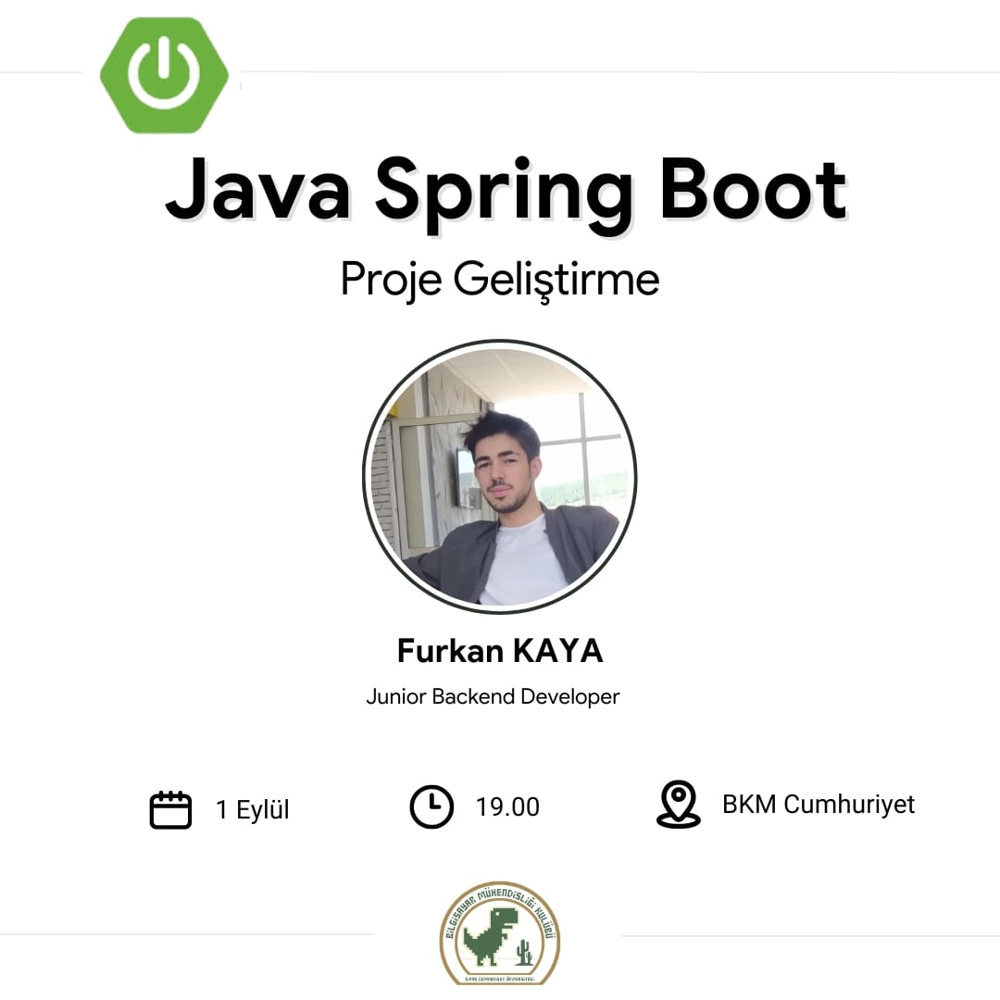

# Spring Boot `Library Project-1`

<div align="center">
<a href="https://www.youtube.com/live/DqzB4eIy5EU?si=lTdfmUKEQEJF7L6N">
  
</a>
</div>

- [YouTube](https://www.youtube.com/live/DqzB4eIy5EU?si=lTdfmUKEQEJF7L6N)

- Simple book inventory application has been developed using Spring Boot, and in addition to the previous project, the entity classes have been written in Kotlin.

<br>

This project is based on the Spring Boot project and uses these packages:

[](https://www.java.com/en/)

[](https://kotlinlang.org/)

[](https://www.postgresql.org/)

[-2022.3-000?style=for-the-badge&logo=intellij-idea&logoColor=white&color=A75499)](https://www.jetbrains.com/idea/)

[](https://maven.apache.org/)

[](https://spring.io/)

[](https://mapstruct.org/)

[](https://insomnia.rest/)

[](https://www.openapis.org/)

<br>

### Installation

- The project is created with Maven, so you just need to import it to your IDE and build the project to resolve the dependencies

<br>

### Database configuration

- Create a PostgreSQL database with the name `springboot_library_project_1` and add the credentials to `/resources/application.yml`

The default ones are :

```yml

spring:
  datasource:
    url: jdbc:postgresql://localhost:5432/springboot_library_project_1
    username: postgres
    password: ****

```

<br>

### Usage

Run the project through the IDE and head out to `http://localhost:8080/`
or
run this command in the command line:

```bsh
mvn spring-boot:run
```

<br>

# License

This project is licensed under the MIT License. See the [LICENSE](LICENSE) file for details

Created by [Mehmet Furkan KAYA](https://www.linkedin.com/in/mehmet-furkan-kaya/)
